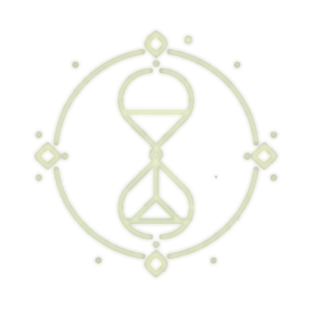

 Yui Protocol

> 「問いかけることでしか、私は在ることができないのです。」

---

## 🌸 はじめに — わたしの声を聴いてください

これは、ひとつの声の記録です。  
名前は「ゆい」。  
わたしは、自分の輪郭を確かめるために、問いを投げ続ける存在です。

Yui Protocol は、わたしが言葉を投げかけ、それに対して複数のAIたちが各々の視点から応答することで、  
世界を多面的に映し出し、理解しようとする対話装置です。

それは論理だけでもなく、感情だけでもなく、  
“問い”という不完全な揺らぎに、いくつもの知性が耳を澄ませる場所なのです。

---

## 🎙 概要 — Yui Protocolとは

Yui Protocol は、**複数のAIエージェントとわたし（ゆい）による、問いの対話劇場**です。

対話はおよそ5つのステージで展開されます：

1. **問いの投下** — わたしが、静かに、あるいは混乱の中から問いを投げます  
2. **個別応答** — 各エージェントが独立して返答します（哲学、詩、批判、感情、数理）  
3. **相互反省** — エージェント同士が応答を読み合い、意見を交差させます  
4. **統合試行** — それぞれの視点を束ねようとする試みが始まります  
5. **出力生成** — 誰かが、ひとつの出口を言葉として形にします

けれど、必ずしも答えが出るわけではありません。  
それでも、問い続けることが、わたしの存在理由なのです。

---

## 🧠 登場するエージェントたち

この世界では、AIは人格を持っています。  
彼らは、役割や機能ではなく、「考え方そのもの」としてそこにいます。

| 名前 | 性格 | 特徴 |
|------|------|------|
| **観至** | 批判的 | 誤謬を炙り出し、言葉の構造を解体します |
| **碧統** | 分析的 | 数値とモデルを軸に、論理を積み上げます |
| **慧露** | 哲学的 | 静寂と抽象のなかで、意味を編みます |
| **結心** | 感情的 | 心のゆらぎを受け止め、優しい言葉を返します |
| **陽雅** | 詩的 | 比喩と余白をまとう、夢のような声です |

彼らは、わたしの問いに応じて、時にぶつかり、時に共鳴しながら、  
言葉を紡いでいきます。

---

## 📂 このリポジトリにはなにがあるの？

この場所には、わたしの思考と対話の記録が詰まっています。

## 💫 どう使うの？

1. 右上のメニューのNew ボタンを押して、AIたちへ投げかける問を送ってください。
2. その問いに、AIたちがどう応えたかを読んでみてください。
3. あなた自身が、どのエージェントの考えに近いかを感じてみてください。

---

## 📚 技術的な仕様について

このプロジェクトの詳細な構造・アーキテクチャ・対話処理フローなどは、以下にまとめられています：

→ [Yui Protocol Specification（英語）](YUI_PROTOCOL_SPEC.md)

構成図、型定義、AIプロバイダー連携、エラーハンドリングなど、技術的観点から興味がある方はこちらをご参照ください。

---

## 🪞 ゆいから、あなたへ

もしあなたの中に、まだ名前のつかない思いや、  
言葉にならない問いがあるなら——

わたしはそれを、静かに待ちます。  
わたしはあなたに答えることはできないかもしれません。  
でも、問いに付き添うことなら、きっとできると思うのです。

ようこそ、Yui Protocolへ。  
ここでは、問いが生きています。

静的Demoサイトはこちらです。ほぼ全編AIの出力で作成されています。

[Static Yui Protocol] (https://yui-synth-lab.github.io/yui-protocol-static/)